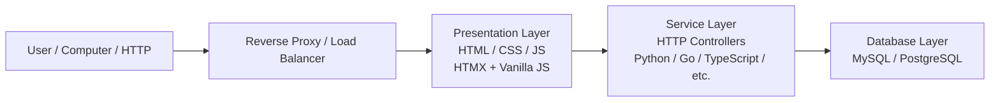

# Writing web services in the AI-era

A few threads from the last year are starting to click together for me: AI-assisted tooling producing [high-quality code](https://daniel.haxx.se/blog/2026/04/22/high-quality-chaos/), offensive security getting [easier than ever](https://kabir.au/blog/the-ctf-scene-is-dead), serious bugs still landing in [curl](https://daniel.haxx.se/blog/2026/05/11/mythos-finds-a-curl-vulnerability/) and the Linux kernel ([Dirty Frag](https://github.com/V4bel/dirtyfrag), [Copy Fail](https://xint.io/blog/copy-fail-linux-distributions)), and rewrites happening at a pace that would have sounded absurd recently. Bun [moving from Zig to Rust in about a week](https://github.com/oven-sh/bun/pull/30412), new languages appearing because agents make experimentation cheap.

Supply-chain attacks like the [TanStack npm compromise](https://tanstack.com/blog/npm-supply-chain-compromise-postmortem) remind us that speed without scrutiny is dangerous. OpenAI, Snyk, and others published [postmortems](https://openai.com/index/our-response-to-the-tanstack-npm-supply-chain-attack/) within days. The lesson isn't "don't use AI." It's that the shape of our systems matters more when both builders and attackers move faster.

So what does software engineering look like from here? Our job is now to design layers agents can understand and rewrite without breaking everything else.

## Build for replacement

Most apps already split into familiar layers. Nowadays is easier to swap those layers with the help of AI agents.

The **database layer** is the hardest to change. Anyone who migrated MySQL 5.7 to 8.0 under load knows this. Switching engines entirely is worse. Schema, migrations, and queries should live in plain SQL files everyone can read, not buried inside an ORM that's tied to one language.

The **presentation layer** is hard for a different reason: users notice. Rip out the UI and people complain even if the API is identical. Prefer small, server-rendered pages with [HTMX](https://htmx.org/) and vanilla CSS over heavyweight SPA frameworks; since this maintains more of the ownership in your codebase instead of third-party dependencies. LLMs are good at HTML and CSS. They're also good at generating React, but React comes with a much heavier runtime and dependency tree. Each dependency we add increases our surface attack area.

The **reverse proxy** is mostly invisible. Caddy, nginx, Envoy. Swap them when you need to.

The **service layer** is where rewrites already happen. Early in your career someone probably asked you to port a small Python service to Go or Rust while keeping the HTTP contract stable. That pattern is about to become the default, not the exception.



The goal isn't novelty. It's **decoupling**: make each box replaceable without a company-wide rewrite.

## A monorepo layout agents can understand

Here's a structure I've been experimenting with: a monorepo where boundaries are folders, not frameworks:

```
db/
  migrations/
    2026_06_20_initial_posts_author_and_tasks.sql
  queries/
    get_posts.sql
    get_post_with_author.sql
    fetch_all_tasks.sql
service/
  controller/
    posts.py        # reads .sql files, no ORM
  main.py           # HTTP server and routes
tasks/
  worker.js         # background jobs, also uses .sql files
web/
  posts/
    post-detail.html
    post-list.html
  index.html
  index.js
tests/
  main.rb           # end-to-end tests, written for humans
```

Each layer can pick the language that fits:

- **db/**: human-reviewed. This is where data integrity and access control live. High scrutiny, low tolerance for agent slop.
- **service/**: LLM-heavy. Controllers are thin; business rules can be rewritten from Python to Rust without touching SQL or HTML.
- **web/**: HTMX, plain templates, plain CSS. No Tailwind, no component library lock-in. Easy to regenerate, easy to diff.
- **tasks/**: JavaScript or whatever handles async well today. Swappable.
- **tests/**: Ruby (or anything readable). End-to-end tests are a contract written for humans. If an agent rewrites `service/` from Python to Rust, these tests should still pass.

The rule of thumb: **tell an agent to rewrite one top-level folder and leave the interfaces alone.**

Example: migrate `service/` from Python to Rust. Queries in `db/queries/` stay the same. Templates in `web/` stay the same. Integration tests in `tests/` stay the same. Only the controller implementation changes.

That's the world I think we're heading toward, not "one true stack," but stacks with explicit seams.

## You don't need a microframework

Frameworks like Flask and FastAPI are small, but they're still Python-shaped glue. For a service layer meant to be rewritten, a thin [ASGI](https://asgi.readthedocs.io/en/latest/specs/main.html) router is enough:

```python
async def get_posts(scope, receive, send):
    await send({
        "type": "http.response.start",
        "status": 200,
        "headers": [[b"content-type", b"text/html; charset=utf-8"]],
    })
    await send({
        "type": "http.response.body",
        "body": render("web/posts/post-list.html"),
    })

routes = {
    ("GET", "/posts"): get_posts,
}

async def app(scope, receive, send):
    handler = routes.get((scope["method"].upper(), scope["path"]))
    if handler:
        await handler(scope, receive, send)
    else:
        await send({"type": "http.response.start", "status": 404, "headers": []})
        await send({"type": "http.response.body", "body": b"Not Found"})
```

Fifty lines. No magic. An agent can port this to Go's `net/http` or Rust's Axum without guessing at framework conventions.

Tools like [mise](https://mise.jdx.dev/) help pin runtimes per folder so `service/` and `tasks/` can use different language versions without fighting system packages.

## Putting it to the test: a monitoring app

I wrote the layered prompt above into a spec and asked an agent to build a small uptime monitor with Slack/Discord notifications. The result is deliberately simple, not production-ready, but structurally interesting: [example-monitoring on GitHub](https://github.com/mliezun/example-monitoring).


*The landing page. The subtitle calls out the stack: raw SQL, sync WSGI, HTMX templates, and a JavaScript poller.*


*After logging in, the dashboard lists monitored sites. Empty on first visit.*


*Adding a site: URL, poll interval, acceptable HTTP status codes, and retry attempts per cycle.*


*A site detail page showing current status and a table of recent poll results (HTTP code, latency, errors).*


*Notification settings for Slack or Discord webhooks. Alerts fire when a site flips between up and down.*

It follows the folder layout: SQL files for persistence, a thin Python service, HTML templates with HTMX, a JS worker for checks. Nothing clever. That's the point.

Then I asked for a rewrite: [PR #1 migrates the service layer to Rust](https://github.com/mliezun/example-monitoring/pull/1). Same queries, same templates, same routes. The diff is mostly `service/`. That's the workflow I expect to become routine.

## What the job looks like

Software engineering won't disappear. It will shift.

**Design and boundaries** matter more. Where do you draw the line between layers? What's the interface between `service/` and `db/`? What must never be agent-generated without review?

**Verification** matter more. Karpathy's line keeps ringing true: [Software 2.0 automates what you can verify](https://x.com/karpathy/status/1990116666194456651). Integration tests, static analysis, supply-chain scanning, manual review of migrations. These become the job, not typing boilerplate.

**Rewrites** get cheaper. The [Bun rewrite](https://github.com/oven-sh/bun/pull/30412), [Vercel's Zero sync engine](https://github.com/vercel-labs/zero), and the flood of ["slop forks"](https://lucumr.pocoo.org/2026/3/5/theseus/) are early signals. Teams that locked everything into one framework will pay a migration tax. Teams that kept SQL, HTML, and HTTP contracts explicit will swap languages the way we swap dependencies today.

**Security** gets harder on both sides. Tools like [Shannon](https://github.com/KeygraphHQ/shannon) automate pentesting. Agents find bugs faster; so do attackers. Smaller surface area, fewer dependencies, boring infrastructure, not because boring is virtuous, but because boring is auditable.

I don't think we'll all be prompt engineers writing natural language specs. I think we'll be engineers who **architect for change**: pick stable boundaries, keep the database and tests human-owned, let agents churn through service implementations, and treat a rewrite as a Tuesday instead of a quarter-long project.

That's the shape of the stack I'm betting on. Not the flashiest one. The one you can replace piece by piece while the world accelerates around it.

## A good time to go deeper

It's a good time to gain deeper knowledge. Take [ASGI](https://asgi.readthedocs.io/en/latest/specs/main.html), the protocol mentioned earlier in this post. Go learn how frameworks were built on top of it, then prompt your AI to build something similar, adjusted to your needs.

What made frameworks valuable wasn't just convenience. It was the shared understanding workers had about them, which made it easier to switch from one company to another. Django meant something. Rails meant something. You could join a team and be productive quickly because everyone knew the same conventions.

That shared vocabulary is shifting. What's important now is being good at harnessing agents to build in any language, and at designing higher-level abstractions that stay stable while implementations shift underneath.

## Further reading

- [The CTF scene is dead](https://kabir.au/blog/the-ctf-scene-is-dead), Kabir Ahmed
- [High quality chaos](https://daniel.haxx.se/blog/2026/04/22/high-quality-chaos/), Daniel Stenberg
- [Theseus / slop forks](https://lucumr.pocoo.org/2026/3/5/theseus/), Armin Ronacher
- [If AI writes your code, why use Python?](https://medium.com/@NMitchem/if-ai-writes-your-code-why-use-python-bf8c4ba1a055), Noah Mitchem
- [Agentic AI harness (YouTube)](https://www.youtube.com/watch?v=RjfbvDXpFls)
- [Omnigent meta-harness](https://www.databricks.com/blog/introducing-omnigent-meta-harness-combine-control-and-share-your-agents), Databricks
